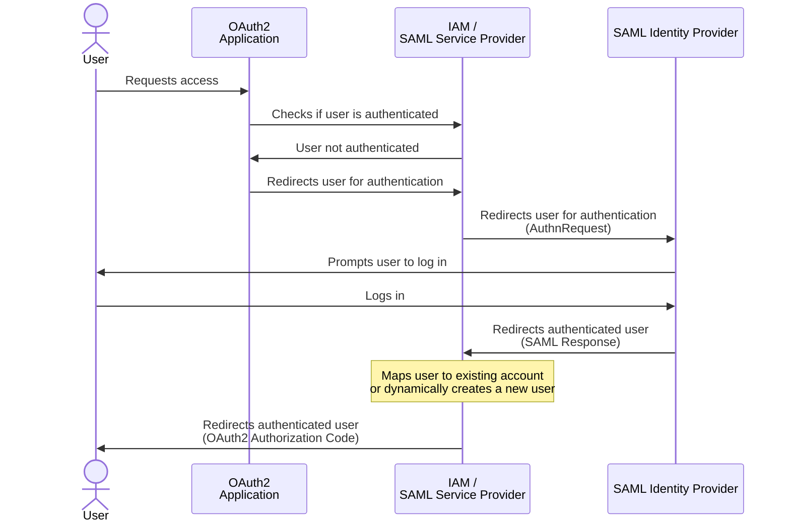

## Goal

The primary objective of this project is to implement SAML authentication using Keycloak by setting up all the necessary components.
One instance of Keycloak serves as the Identity Provider (IdP), while another operates as the Service Provider (SP).
Additionally, a demo application is included to act as an application secured by the Keycloak SP, and the associated workflow exclusively accepts SAML authentications.

## SP-initiated Flow



## Context

- Keycloak SP runs on `http://localhost:8081`
- Keycloak IdP runs on `http://localhost:8082`
- Demo app runs on `http://localhost:8083`
- SP SAML broker descriptor can be obtained with `http://localhost:8081/realms/SP_realm/broker/IDP_SAML_SP_INITIATED/endpoint/descriptor`
- IdP SAML descriptor can be obtained with `http://localhost:8082/realms/IdP_realm/protocol/saml/descriptor`

## SP-initiated flow setup

**On IdP:**
- Create realm `IdP_realm`.
- On realm `IdP_realm`, go to Realm Settings > Keys > Providers. Disable `rsa-generated` and click on Add Provider > rsa and add a provider with private key (see `keys/idp_private_key.pem`).

**On SP:**
- Create realm `internal`.
- Create client `app` on realm `internal` for an example Python app with `Client authentication` on (for client ID / client secret).
- Create realm `SP_realm`.
- On realm `SP_realm`, go to Realm Settings > Keys > Providers. Disable `rsa-generated` (or lower its priority) and click on Add Provider > rsa then add a provider with private key (see `keys/sp_private_key.pem`).
- Create an OpenID Connect client on realm `SP_realm` with client id `OIDC_FRONTEND_CLIENT` setting `Root URL`, `Home URL` and `Valid redirect URIs` to `http://localhost:8083/`.
- Add SAML identity provider with alias `IDP_SAML_SP_INITIATED` on `SP_realm` with `Service provider entity ID` set to `SP_SAML_SP_INITIATED` and `SAML entity descriptor` set to `http://localhost:8082/realms/IdP_realm/protocol/saml/descriptor`.
- Create a new authentication flow with name `SAML_IDP_FLOW` in Authentication > Create flow. Add an execution, choose `Identity Provider Redirector`, set it as required and click on the cog icon to edit its config and set `IDP_SAML_SP_INITIATED` as default identity provider.
- Go back to client `OIDC_FRONTEND_CLIENT`, got to Advanced section and set `SAML_IDP_FLOW` as browser flow in Authentication flow overrides.
- To dynamically create users on the SP without prompting the user to fill a form, go to `Authentication` create a new flow `CUSTOM_FIRST_BROKER_LOGIN_FLOW`, add two steps `Create User If Unique` and `Automatically set existing user` and set both as `Alternative`. Now go back to your newly added Identity Provider and set `CUSTOM_FIRST_BROKER_LOGIN_FLOW` as `First login flow override`.
- Go to Realm roles and create a role named `CUSTOMER`.
- Go to Identity Providers > `IDP_SAML_SP_INITIATED` > Mappers and create a new mapper with type `Hardcoded Role` and value `CUSTOMER`.

**Back to IdP:**
- Create a new client on realm `IdP_realm` with the UI using Clients > Import Client and import SP SAML XML descriptor.

## IdP-initiated Flow

The sequence set above refers to the SP-initiated flow, where the user first accesses our application and is then redirected to the IdP. It's also possible to implement an IdP-Initiated flow, where the user first accesses the IdP and is then redirected to the application.  
Setting up a SAML client for this flow is relatively simple, though it's less intuitive if there's a need to redirect to an OAuth2 client to achieve behavior similar to the SP-Initiated flow described above.  
This functionality is undocumented, and there might be a "cleaner" way to do it. My solution here is to redirect the user to the Oauth2 client login page after SAML authentication. The goal is to use the session cookie to implicitly connect the user on the OAuth2 client and redirect them to the application.

You will find in the project a functional example of the IdP-Initiated flow resulting in a redirection to the application with an Authorization Code. Here are some important configuration elements:  

**On the SP side:**
- I had to create a second IdP with a different `Service provider entity ID` (here `SP_SAML_IDP_INITIATED`) because Keycloak, as an IdP, does not allow creating two SAML clients with the same entity ID. This is solely a constraint due to the demo requirements. The IdP is completely identical to the first one.
- I also had to duplicate the OAuth2 client for demonstration purposes. You'll find the client `OIDC_FRONTEND_CLIENT_IDP_INITIATED`, which is identical to `OIDC_FRONTEND_CLIENT`, the only difference being that the `Browser Flow` has no override. Here we do not want to force the user to go through the IdP since they are already coming from it.
- Create a SAML client `SAML_CLIENT_IDP_INITIATED`, set `idp-initiated` as the value for `IDP-Initiated SSO URL name` so that KC declares an endpoint `http://localhost:8081/realms/SP_realm/broker/IDP_SAML_IDP_INITIATED/endpoint/clients/idp-initiated` which will be able to process the SAML assertions from the IdP.
- On this client, disable `Force POST binding` and, in `Advanced`, set the `Assertion Consumer Service Redirect Binding URL` to `http://localhost:8081/realms/SP_realm/protocol/openid-connect/auth?client_id=OIDC_FRONTEND_CLIENT_IDP_INITIATED&response_type=code`. The goal is to redirect (rather than POST, which will not be supported) to the OAuth2 login page after the user session has been opened via SAML auth.

**On the IdP side:**
- Create a new SAML client with the correct Client ID/Entity ID (here `SP_SAML_IDP_INITIATED`) and again `idp-initiated` as the value for `IDP-Initiated SSO URL name`.
- Here we can simply set `http://localhost:8081/realms/SP_realm/broker/IDP_SAML_IDP_INITIATED/endpoint/clients/idp-initiated` as the `Master SAML Processing URL`, and POST binding will be supported.

For testing, refer to the [Testing](#testing) section.

## Hybrid between SP and IdP-initiated

You may find yourselves stuck if you absolutely need a flow initiated by the SP but the IdP does not properly implement the SAML standard. This is the case, for example, with Google SAML which does not retain the RelayState parameter value. However, RelayState is crucial for Keycloak during an SP-Initiated flow as it stores a unique session ID there.
In this case, it is possible to implement an SP-initiated flow that will switch to an IdP-initiated flow upon receiving the SAML Response.

This is obviously not a conventional method, it's more of a workaround, but I provide an example that can help resolve a situation.

You can find an example in this project, where, once again, the IdP and clients have been duplicated and have names ending in `_HYBRID_SP_TO_IDP_INITIATED`.
The principle is simple: Set up everything needed for the SP-Initiated flow and the IdP-initiated flow described above, the only difference will be the information provided to the IdP. Rather than using the "classic" Assertion Consumer Service URL of the SP-initiated flow, we will provide the IDP-Initiated SSO URL `http://localhost:8081/realms/SP_realm/broker/IDP_SAML_IDP_INITIATED/endpoint/clients/idp-initiated` mentioned earlier.
As a result, the IdP will receive an AuthnRequest and respond to a URL intended for the IdP-initiated flow, thus ignoring the missing or poorly valued RelayState.

## Startup

Docker compose runs 5 containers: Keycloak IdP, Keycloak SP, a demo Python app and two Postgres instances for KC.  
Keycloak containers load pre-configured realms stored in the `realms` folder.  
On startup, the Python app waits for Keycloak to be ready then creates a new user on IdP with username `john` and password `john`.

## Notes

#### Private keys
You can of course keep RSA auto-generated keys, but custom ones were added on both sides to demonstrate how to use them.  
RSA private keys are included in the exported realms JSON in plain text for convenience.  
Private keys should be kept secret and not be shared in a real environment. As of version 25.0, Keycloak stores private keys in the database as entries in the `component_config` table.    
For reference:  
```sql
SELECT * FROM component C
JOIN component_config CC ON C.id = CC.component_id
WHERE C.name = 'rsa' -- Name manually set when adding key provider on the UI
AND CC.name = 'privateKey'
```

For managing secrets and Keycloak configuration in general, I recommend using https://github.com/adorsys/keycloak-config-cli.

#### Authentication Flow
A custom authentication flow is used to ensure that user connections go through the IdP as the only option, without any prompt.  
Alternatively, this can be achieved by using the `kc_idp_hint` query parameter in the first auth redirect request made by the frontend client.  

#### User Creation
Users are dynamically created on the SP without prompting the user to fill out a form. The email provided by the IdP is used as the username, so when the user logs in again, the same account is used.  
The username format is determined by the NameIDFormat displayed in both SAML entities descriptors. If multiple NameIDFormat options are available, as in this case, the IdP selects its preferred option, and Keycloak implicitly chooses the persistent format. This can be overridden in the client config on the IdP.  
If needed, additional information can be added to the IdP response and mapped to user attributes on the SP, such as email, first name, etc.  
Roles are provided by the IdP, but for demo purposes, a role (`CUSTOMER`) is hardcoded on the SP.  

## How to run

- `docker-compose up`
- Follow instructions in [Testing](#testing)

## Testing

### SP-initiated

1. Go to http://localhost:8083 (Demo Python app that acts as the KC protected service/frontend)
2. You should be redirected to the IdP login page
3. Login with username `john` and password `john`
4. You should be redirected to the SP which will create a new user account
5. You should be redirected to the demo app and see a welcome message


### IdP-initiated

1. Go to http://localhost:8082/realms/IdP_realm/protocol/saml/clients/idp-initiated (IdP Initiated SSO URL)
2. Login with username `john` and password `john`
3. You should be redirected to the SP which will create a new user account
4. You should be redirected to the demo app and see a welcome message

### Hybrid SP-Initiated to IdP-initiated

1. Go to http://localhost:8083/hybrid
2. You should be redirected to the IdP login page
3. Login with username `john` and password `john`
4. You should be redirected to the SP which will create a new user account
5. You should be redirected to the demo app and see a welcome message