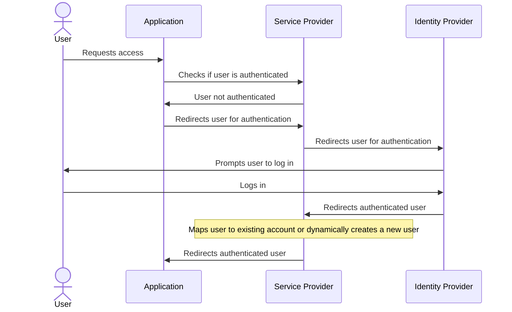

## Goal

The primary objective of this project is to implement SAML authentication using Keycloak by setting up all the necessary components.
One instance of Keycloak serves as the Identity Provider (IdP), while another operates as the Service Provider (SP).
Additionally, a demo application is included to act as an application secured by the Keycloak SP, and the associated workflow exclusively accepts SAML authentications.



## Context

- Keycloak SP runs on `http://localhost:8081`
- Keycloak IdP runs on `http://localhost:8082`
- Demo app runs on `http://localhost:8083`
- SP SAML broker descriptor can be obtained with `http://localhost:8081/realms/SP_realm/broker/saml/endpoint/descriptor`
- IdP SAML descriptor can be obtained with `http://localhost:8082/realms/IdP_realm/protocol/saml/descriptor`

## Pre-prepared Steps

**On IdP:**
- Create realm `IdP_realm`.
- On realm `IdP_realm`, go to Realm Settings > Keys > Providers. Disable `rsa-generated` and click on Add Provider > rsa and add a provider with private key (see `keys/idp_private_key.pem`).

**On SP:**
- Create realm `internal`.
- Create client `app` on realm `internal` for an example Python app with `Client authentication` on (for client ID / client secret).
- Create realm `SP_realm`.
- On realm `SP_realm`, go to Realm Settings > Keys > Providers. Disable `rsa-generated` (or lower its priority) and click on Add Provider > rsa then add a provider with private key (see `keys/sp_private_key.pem`).
- Create an OpenID Connect client on realm `SP_realm` with client id `frontend` setting "Root URL", "Home URL" and "Valid redirect URIs" to `http://localhost:8083/`.
- Add SAML identity provider with alias `SAML_IDP` on `SP_realm` with "Service provider entity ID" set to `http://localhost:8081/realms/SP_realm` and "SAML entity descriptor" set to `http://localhost:8082/realms/IdP_realm/protocol/saml/descriptor`.
- Create a new authentication flow with name `SAML_IDP_FLOW` in Authentication > Create flow. Add an execution, choose `Identity Provider Redirector`, set it as required and click on the cog icon to edit its config and set `SAML_IDP` as default identity provider.
- Go back to client `frontend`, got to Advanced section and set `SAML_IDP_FLOW` as browser flow in Authentication flow overrides.
- To dynamically create users on the SP without prompting the user to fill a form, go to Authentication > `first broker login` > and disable `Review Profile`. (Alternatively, if you wish to keep this flow intact you can duplicate it and edit First login flow in IdP settings page)
- Go to Realm roles and create a role named `CUSTOMER`.
- Go to Identity Providers > `SAML_IDP` > Mappers and create a new mapper with type `Hardcoded Role` and value `CUSTOMER`.

**Back to IdP:**
- Create a new client on realm `IdP_realm` with the UI using Clients > Import Client and import SP SAML XML descriptor.

## Startup

Docker compose runs 5 containers: Keycloak IdP, Keycloak SP, a demo Python app and two Postgres instances for KC.  
Keycloak containers load pre-configured realms stored in the `realms` folder.  
On startup, the Python app waits for Keycloak to be ready then creates a new user on IdP with username `john` and password `john`.

## Notes

#### Private keys
You can of course keep RSA auto-generated keys, but custom ones were added on both sides to demonstrate how to use them.  
RSA private keys are included in the exported realms JSON in plain text for convenience.  
Private keys should be kept secret and not be shared in a real environment. As of version 23.0, Keycloak stores private keys in the database as entries in the `component_config` table.    
For reference:  
```sql
SELECT * FROM component C
JOIN component_config CC ON C.id = CC.component_id
WHERE C.name = 'rsa' -- Name manually set when adding key provider on the UI
AND CC.name = 'privateKey'
```

#### SP Authentication Flow
A custom SAML_IDP_FLOW authentication flow is used to ensure that user connections go through the IdP as the only option, without any prompt.  
Alternatively, this can be achieved by using the kc_idp_hint=SAML_IDP query parameter in the first auth redirect request made by the frontend.  

#### User Creation
Users are dynamically created on the SP without prompting the user to fill out a form. The persistent ID provided by the IdP is used as the username, so when the user logs in again, the same account is used.  
The username format is determined by the NameIDFormat displayed in both SAML entities descriptors. If multiple NameIDFormat options are available, as in this case, the IdP selects its preferred option, and Keycloak implicitly chooses the persistent format. This can be overridden in the client config on the IdP.  
If needed, additional information can be added to the IdP response and mapped to user attributes on the SP, such as email, first name, etc.  
Roles are provided by the IdP, but for demo purposes, a role (`CUSTOMER`) is hardcoded on the SP.  

## How to run

- `docker-compose up`
- Follow instructions in [Testing](#testing)

## Testing

1. Go to `http://localhost:8083` (Demo Python app that acts as the KC protected service/frontend).
2. You should be redirected to the IdP login page.
3. Login with username `john` and password `john`.
4. You should be redirected to the SP which will create a new user account.
5. Finally, you should be redirected to the demo app and see a welcome message.
